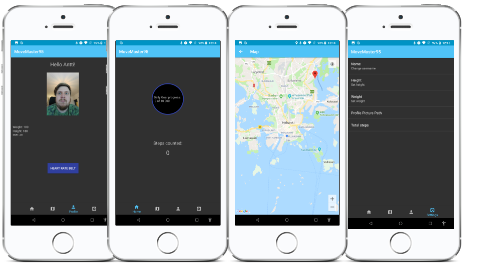

  
# MoveMaster95
MoveMaster95 is a fitness tracking & motivation application that uses multiple phone sensors to collect data of your fitness progress.  
  
## Features
* Step counter  
* Dark theme  
* Accessibility checked  
* App navigation through tabs and fragments  
* Persistence through SharedPreferences  
* Google Maps and GPS  
* AR minigame (MegaBlaster300)  
* Heart rate sensor via Bluetooth  
* Camera and photo saving  
* Share step count to friends  
## Getting Started
To get started with MoveMaster95 you need an Android phone (with Android 7.0 or higher), Android Studio installed on your computer and optionally a heart rate sensor.  
## Prerequisites
* Android phone (with Android 7.0 or higher)  
* Android Studio  
* Git  
* Heart Rate Sensor(optional)  
## Installing
1. Install Android Studio  
* Android Studio is available [here](https://developer.android.com/studio/) for installing follow the instructions in the link.  
2. Clone the repo  
`git clone https://github.com/Penys/MoveMaster95.git`  
3. Open cloned project in Android Studio  
* Start Android Studio and open the cloned project
4. Build & run MoveMaster95  
* Run the app on a real device or an emulator.  
5. Start app  
* Now you can start using MoveMaster95 application.  
## Built With
* Android Studio  
* Git for version control  
* WhatsApp - for messaging  
## License
This project is licensed under the Open Source License.  
## Acknowledgments
We wanna tip our fedora for:  
* Erkki Halinen [@ErkHal](https://github.com/ErkHal)  
* Sompasauna provided recreation activities  
## Contributors
[@anttinym](https://github.com/anttinym)  
  
[@pessi22](https://github.com/pessi22)  
  
